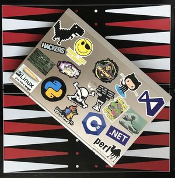
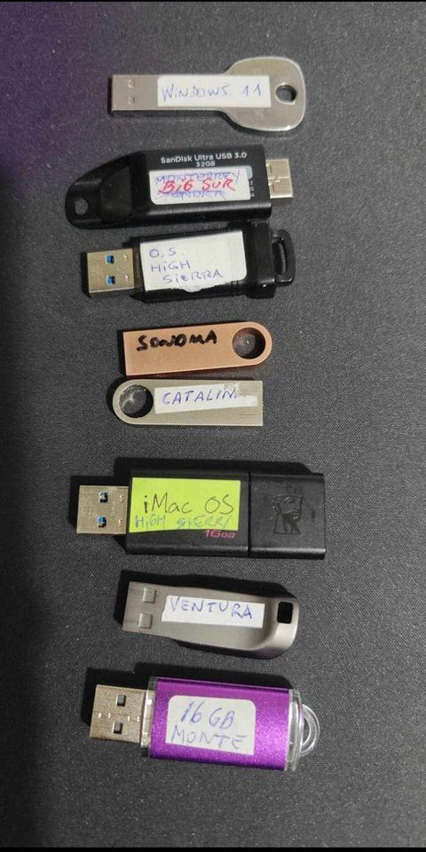

## Hi, folks 👋 I'm a software engineer and this is my digital garden 🌱

* ### 📝
* [Manage data streams with Reactor Project](https://fedor-malyshkin.medium.com/manage-data-streams-with-reactor-project-da56922a8c4c)
* [GitHub Actions to build your Java/Scala application, test and deploy it to Kubernetes cluster](https://levelup.gitconnected.com/github-actions-to-build-your-java-scala-application-test-and-deploy-it-to-kubernetes-cluster-484779dfc200) 
* [Conway’s Game of Life streaming with Akka Streams](https://fedor-malyshkin.medium.com/conways-game-of-life-streaming-with-akka-streams-abddb9773d48)
* [Conventional Commits](//www.conventionalcommits.org)
* [My productivity app is a never-ending .txt file](//jeffhuang.com/productivity_text_file/)
* [RegExr](//regexr.com)
* [All Algorithms implemented in Python](//github.com/TheAlgorithms/Python/blob/master/DIRECTORY.md)
* [Python Design patterns](//github.com/faif/python-patterns)
* [The Hitchhikers Guide to Python!](//docs.python-guide.org)

### 🚀
* [M.A.C.E. Project - M*c Application Compatibility Environment](//mace.software/)
* [Dangerous Dave](//agafnik.com/testchambers/webdave/)
* [Highway Encounter (ZX)](//torinak.com/qaop#!encounter)
* [HypnoticOwl](//hypnoticowl.com/games/)
* [Zelda](//emupedia.net/emupedia-game-zelda)
