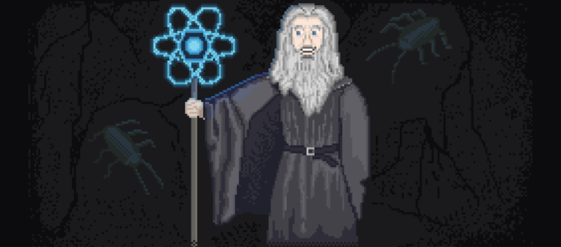

### Hi there 👋

<!--
**j69/j69** is a ✨ _special_ ✨ repository because its `README.md` (this file) appears on your GitHub profile.

Here are some ideas to get you started:

- 🔭 I’m currently working on ...
- 🌱 I’m currently learning ...
- 👯 I’m looking to collaborate on ...
- 🤔 I’m looking for help with ...
- 💬 Ask me about ...
- 📫 How to reach me: ...
- 😄 Pronouns: ...
- ⚡ Fun fact: ...
-->

* [RegExr](//regexr.com)
* [All Algorithms implemented in Python](//github.com/TheAlgorithms/Python/blob/master/DIRECTORY.md)
* [Python Design patterns](//github.com/faif/python-patterns)
* [The Hitchhikers Guide to Python!](//docs.python-guide.org)

##  MISSION STATEMENT
Your code is only as good as its weakest part. This is my main principle and motto. I care primarily on the quality of the code. I would like to work with professionals as to exchange experience and learn all the time.

I have always been interested in programming and computers which was why I chose to follow this career path. As a senior programmer I was responsible for planning and implementing web applications and software development. Moreover, I was writing technical & project documentation, designing and optimizing databases and source code.

# Cool links

* [cool desktop saver](//github.com/pedrommcarrasco/Brooklyn/releases/download/1.0.0/Brooklyn.saver.zip)
* [Wolfenstein 3D](//wolf3d.atw.hu/)
* [Quake3 JS](//quakejs.com/)
* [Dangerous Dave](//agafnik.com/testchambers/webdave/)
* [Diablo](//diablo.rivsoft.net)
* [Highway Encounter (ZX)](//torinak.com/qaop#!encounter)
* [ZX Spectrum games](//torinak.com/qaop/games)
* [Robo!](//dizaina.net/z/robbo/?nosound)
* [HypnoticOwl](//hypnoticowl.com/games/)
* [CloudsPiano](//labs.plan8.se/cloudspiano/)
* [GIF DANCE PARTY](//gifdanceparty.giphy.com)
* [Windows 93](//www.windows93.net)
* [Open Source Game Clones](//osgameclones.com)
